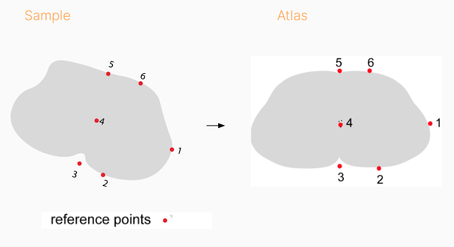
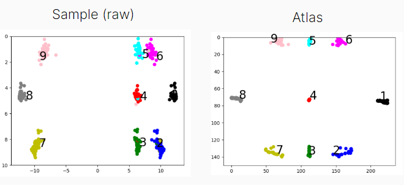

# Cordmap data input guide

## Raw data requirements

### Standard cordmap registration

The raw data provided by the Salk is organised as follows:

Each sample is provided as two files,  the output of a custom script called Build a Brain, 
which was also developed in house at the Salk. Both files are .csv one of these contains 
all the data (`cardinal_subpop_Data.csv`), the other is a key (`cardinal_subpop_Key.csv`) to 
allow selectively loading out data of particular types.

This `_Key.csv` contains a list of keys that can be used as the index of the data 
files in the "Type" column. A single type could be a cell population, a contour type
or a segment type, for example.

Each category of data is either a contour or a point. Contours are collections of 
points that make the entire outline of particular biological features, for example 
the outline of the grey or white matter. Each z position from a sample would therefore 
contain a grey matter and a white matter contour. These outlines are converted to an 
image which is then the basis of registration. The z position is used to select the 
appropriate 2d image from the atlas to use in this registration.

This `_Key.csv` file is formatted as follows:

Columns are [`objectNames`, `isPoint`, `isContour`, `Type`]

`objectNames`: The label of each `Type`
`isPoint`: whether the type is a point (e.g. cell position)
`isContour`: whether the type is a contour (e.g. grey matter outline)

The `_Data.csv` file is formatted as follows:

Columns are [`Type`, `Slice`, `X`, `Y`, `Z` ,`isPoint`, `isContour`, `isPoint`,`contourID`]

`Type`: The index relating to a specific kind of data (e.g. `Grey` from the key file
would be the grey matter contour used in registration, `V1 Calbindin` would be V1 calbindin 
positive neurons). The index of these keys is stored in the `_Key.csv` and that index can be
used to selectively load from the `Data.csv` file.

`Slice`: The slice number, which indicates all the data corresponding to a single section.

`X`: The x coordinate of the point represented.
`Y`: The y coordinate of the point represented.
`Z`: The z coordinate of the point represented.
`isPoint` | `isContour`: Whether the row is a point or part of a contour (e.g. a cell position
is a point but a row of type `Grey` would be the position of a point that is actually part 
of a contour outline of the grey matter.
`contourID`: the index of the contour.

Slices are centered around 0, so slices x coordinates are expected to contain both positive and negative values 
depending on whether the point is to the right or left of the midline. Similarly, y coordinates will contain
positive and negative values depending on whether the point lies above or below the midpoint.

Registration is computed using the grey matter and white matter outlines and therefore these are 
fundamentally required for registration. Any population that is defined as a point (`isPoint`=1) will be treated as
a cell population and coordinates will be transformed to standard space and saved in the output as a cell
population.

### Fiducial marker registration

The fiducial marker registration in cordmap is fundamentally different to standard registration. Instead
of using the grey matter contour, a small set of points are used that are selected around the white matter
and are used to register the sample to the atlas. 

There are 9 markers in total, three on the left, three on the right and three down the midline.

     e.g.    Atlas register_fiducial markers
     --------------------------------------
                 L9    L5     L6

             L8        L4         L1

                L7     L3     L2
    ---------------------------------------

Fiducial markers for all atlas sections have been annotated on a downsampled version of the
salk_10um cord atlas and these have been interpolated to resample back to atlas resolution. 
Fiducial markers are needed for every coronal section that is processed.

`register_fiducial` assumes that input data will be in a single csv file that contains, for each
coronal section:

- The z position in the sample relative to C8
- The zxy positions for each fiducial marker in the sample L1 to L9. None of these can be missing
- The label of each of these markers (e.g. "L1")

It assumes:
- There are no missing values for the fiducial markers.
- There are no duplicates (i.e. each section has exactly one of each fiducial marker)

Other label types in the "Point" column are treated as neuronal populations and usually have the name
`Population1`, `Population2` etc.

These values should all be positive. In the originally provided data the points on the left were negative
and offset:

Where all 3 points (L7-L9) are found to be negative, a specific correction is applied to deal with this
edge case only. This is in `register_fiducial.io.correct_raw_coordinates`.

The x and y coordinates expected for fiducial markers were originally on the order of between 0 and 20. 
When the raw data (sample) does not conform to this, the sample will be scaled to atlas resolution during registration.
This is done by comparing the min/max x and y of the sample and scaling this to closely match the atlas prior to 
registering the image.

This has been tested for a range of resolutions and image size but where the scale is very different it is 
important to test and validate the registration outputs.

